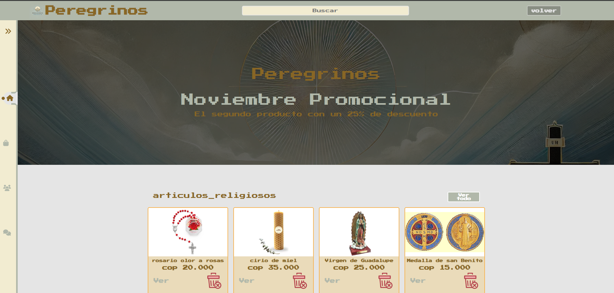
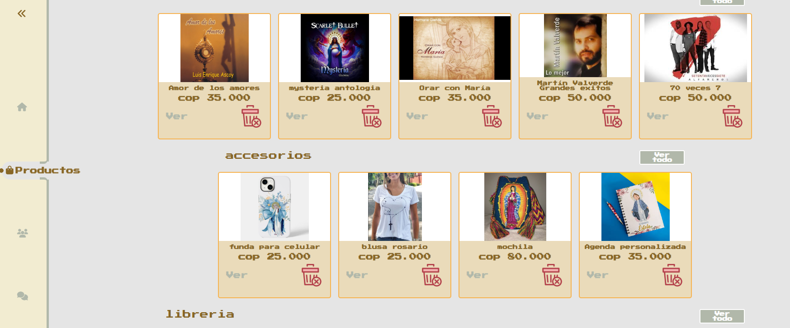
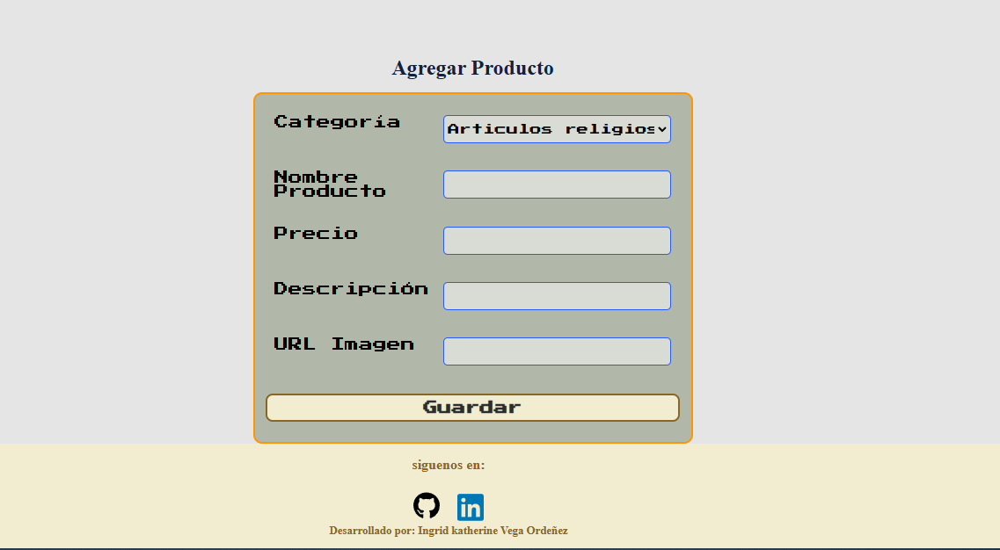

# PEREGRINOS - ALURAGEEK

Este proyecto es de carácter académico, es un e-comerce de artículos religiosos, el usuario puede ver y agregar y eliminar productos, además de buscarlos a partir de palabras claves.
Los productos se presentan en tarjetas que contienen información como:       
	Imagen del producto  
	Nombre  
	Precio  
	El link para ver detallas del producto como su descripción  
	Y un botón para eliminar el producto
Se encuentran agrupados por categorías de las cuales podemos decir: artículos religiosos; allí se encuentran todo lo perteneciente a lo necesario para el ejercicio de las practicas de piedad contempladas dentro del catecismo católico, tales como rosarios, denarios, imágenes entre otras.
Accesorios: allí se encuentran objetos de uso cotidiano con motivos religiosos como fundas de celular, camisetas y más.
Música: Encontraras trabajos discográficos de diferentes artistas católicos como Luis enrique ascoy, Martin Valverde entre los más conocidos.
Librería: En esta sección puedes encontrar biblias, libros de ritual católico como ordo, misal, así como escritores de la talla de Ana Catalina Emerick y muchos más.


## Funcionalidad

	Esta pagina está compuesta por su titulo, un cuadro de búsqueda y un botón de volver que nos permite navegar entre paginas.   
	Una barra de navegación lateral que se puede contraer o expandir según la necesidad del usuario dando clic en el icono  
	Productos nos desplaza directamente al contenedor de las tarjetas anteriormente descritas con los productos  
	Sobre nosotros: Encontraras una breve reseña de la empresa.   
	Agregar producto: Este link te lleva a una nueva pagina compuesta por un formulario que contiene una lista desplegable con las diferentes categorías para escoger la de tu preferencia. Nombre del producto, precio, descripción aquí puedes poner una breve reseña como el material de elaboración, medidas, artista o escritor según sea el caso de cada producto. url imagen: aquí debes poner la dirección donde se encuentra alojada la imagen del producto y finalmente el botón guardar al dar click te enviar a  la pagina de envió exitoso si todo salió bien, puedes volver al dar click en productos para visualizar el producto recién agregado. Cabe resaltar que todos los datos del formulario deben ser completados y este está validados para que esta condición se cumpla.


## Screenshots






## Tech Stack

**Client:** Html, Css y JavaScript

**Server:** Node, json Server, MockAPI


## Run Locally

Clone the project

```bash
  git clone https://github.com/ingridk12/challenge-AluraGeek.git

Go to the project directory

```bash
  cd my-project
```

Install dependencies

```bash
  npm install
```

Start the server

```bash
  npm run start
```

